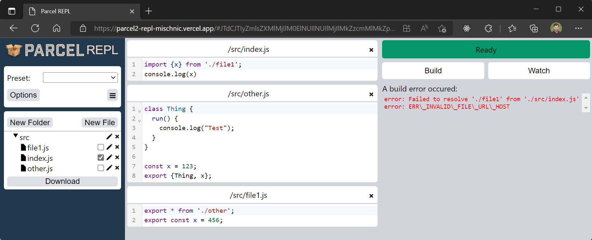
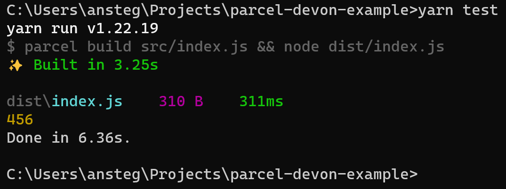

# parcel-devon-example

An example based on a [parcel REPL test](https://parcel2-repl-mischnic.vercel.app/#JTdCJTIyZmlsZXMlMjIlM0ElNUIlNUIlMjIlMkZzcmMlMkZpbmRleC5qcyUyMiUyQyU3QiUyMnZhbHVlJTIyJTNBJTIyaW1wb3J0JTIwJTdCeCU3RCUyMGZyb20lMjAnLiUyRmZpbGUxJyUzQiU1Q25jb25zb2xlLmxvZyh4KSUyMiUyQyUyMmlzRW50cnklMjIlM0F0cnVlJTdEJTVEJTJDJTVCJTIyJTJGc3JjJTJGb3RoZXIuanMlMjIlMkMlN0IlMjJ2YWx1ZSUyMiUzQSUyMmNsYXNzJTIwVGhpbmclMjAlN0IlNUNuJTIwJTIwcnVuKCklMjAlN0IlNUNuJTIwJTIwJTIwJTIwY29uc29sZS5sb2coJTVDJTIyVGVzdCU1QyUyMiklM0IlNUNuJTIwJTIwJTdEJTIwJTVDbiU3RCU1Q24lNUNuY29uc3QlMjB4JTIwJTNEJTIwMTIzJTNCJTVDbmV4cG9ydCUyMCU3QlRoaW5nJTJDJTIweCU3RCUzQiUyMiU3RCU1RCUyQyU1QiUyMiUyRnNyYyUyRmZpbGUxLmpzJTIyJTJDJTdCJTIydmFsdWUlMjIlM0ElMjJleHBvcnQlMjAqJTIwZnJvbSUyMCcuJTJGb3RoZXInJTNCJTVDbmV4cG9ydCUyMGNvbnN0JTIweCUyMCUzRCUyMDQ1NiUzQiUyMiU3RCU1RCU1RCUyQyUyMm9wdGlvbnMlMjIlM0ElN0IlMjJlbnRyaWVzJTIyJTNBJTVCJTVEJTJDJTIybWluaWZ5JTIyJTNBZmFsc2UlMkMlMjJzY29wZUhvaXN0JTIyJTNBdHJ1ZSUyQyUyMnNvdXJjZU1hcHMlMjIlM0FmYWxzZSUyQyUyMnB1YmxpY1VybCUyMiUzQSUyMiUyRl9fcmVwbF9kaXN0JTIyJTJDJTIydGFyZ2V0VHlwZSUyMiUzQSUyMmJyb3dzZXJzJTIyJTJDJTIydGFyZ2V0RW52JTIyJTNBbnVsbCUyQyUyMm91dHB1dEZvcm1hdCUyMiUzQW51bGwlMkMlMjJobXIlMjIlM0FmYWxzZSUyQyUyMm1vZGUlMjIlM0ElMjJwcm9kdWN0aW9uJTIyJTJDJTIycmVuZGVyR3JhcGhzJTIyJTNBZmFsc2UlMkMlMjJ2aWV3U291cmNlbWFwcyUyMiUzQWZhbHNlJTJDJTIyZGVwZW5kZW5jaWVzJTIyJTNBJTVCJTVEJTJDJTIybnVtV29ya2VycyUyMiUzQTAlN0QlMkMlMjJ1c2VUYWJzJTIyJTNBZmFsc2UlMkMlMjJicm93c2VyQ29sbGFwc2VkJTIyJTNBJTVCJTVEJTJDJTIydmlld3MlMjIlM0ElNUIlMjIlMkZzcmMlMkZpbmRleC5qcyUyMiUyQyUyMiUyRnNyYyUyRm90aGVyLmpzJTIyJTJDJTIyJTJGc3JjJTJGZmlsZTEuanMlMjIlNUQlMkMlMjJjdXJyZW50VmlldyUyMiUzQTIlN0Q=) that Devon Govett [linked to in a github discussion for issue 8333](https://github.com/parcel-bundler/parcel/pull/8333#issuecomment-1200455329)

I tried running the parcel REPL test, but I get this error:

So this repo has the same code, which enables you to see the results.

Here's what I see when I run the test:

The value `456` comes from the named export in `file1.js`, not the wildcard-exported file (`other.js`)

Changing the order of the exports in `file1.js` has no effect - it will still print `456`. The rule seems to be "named exports win over wildcard exports", rather than "last export wins".
